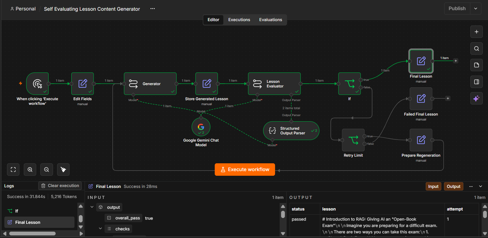

# Self-Evaluating Lesson Content Generator

An autonomous agentic workflow and interactive web application that generates beginner-friendly educational lessons on any topic, rigorously audits them against an 8-point quality rubric, and automatically self-corrects using evaluator feedback loops.



---


## Overview

Traditional single-pass LLM prompts frequently suffer from hallucinations, unexplained technical jargon, or uneven teaching flow. The **Self-Evaluating Lesson Content Generator** solves this by implementing an autonomous **Generator-Evaluator Agentic Feedback Loop**:

1. **Content Generator**: Creates a structured, beginner-level lesson tailored for high school graduates with limited technical vocabulary.
2. **Evaluator Agent**: Audits the draft against **8 hard PASS/FAIL quality checks** using structured JSON output schemas.
3. **Autonomous Routing**:
   - If **all 8 checks pass** $\to$ Immediately accepts and outputs the **Final Lesson**.
   - If **any check fails** $\to$ Automatically extracts specific remediation feedback and re-prompts the Generator for an improved draft (bounded by a maximum 3-attempt safety limit).
   - If retry limit is reached $\to$ Delivers a controlled **Failed Final Lesson** terminal output with full audit history.

Originally engineered as an **n8n agentic workflow**, the project now features a **full-stack web application** with an interactive dashboard, live workflow monitoring, multi-format export capabilities (Word, PDF, Text), and optional client-side API key management.

---

## Workflow Video Walkthrough

A comprehensive video walkthrough demonstrating the workflow architecture, execution paths, and retry/regeneration behavior:

📹 **[https://drive.google.com/file/d/15yYll0uGifpvhGQJLQHGvmUfIn4XGkDP/view?usp=drive_link](https://drive.google.com/file/d/15yYll0uGifpvhGQJLQHGvmUfIn4XGkDP/view?usp=drive_link)** 

### Walkthrough Chapters & Demonstration Structure

| Chapter | Topic | What is Demonstrated |
|---|---|---|
| **Part 1** | **Architecture & Node Topology** | Tour of the complete n8n canvas: Manual Trigger $\to$ Edit Fields $\to$ Generator $\to$ Store Generated Lesson $\to$ Evaluator $\to$ Structured Output Parser $\to$ If Router $\to$ Retry Limit $\to$ Prepare Regeneration $\to$ Final Lesson / Failed Final Lesson. |
| **Part 2** | **Successful First-Pass Execution** | Execution with `topic = "Introduction to RAG"`. Demonstrates all 8 rubric checks passing (`overall_pass = true`), routing through the `If (TRUE)` branch, and delivering the verified `Final Lesson` on Attempt 1. |
| **Part 3** | **Retry Limit Safeguard Execution** | Demonstrates the bounded guardrail: persistent failures across 3 iterations safely route to `Failed Final Lesson` with complete diagnostic feedback instead of entering an infinite loop. |

---

## Architecture & Node Pipeline

```text
               ┌──────────────────────────────┐
               │ When clicking 'Execute'      │ (Manual Trigger)
               └──────────────┬───────────────┘
                              ▼
               ┌──────────────────────────────┐
               │ Edit Fields (Topic, Attempt) │ (Initialize state)
               └──────────────┬───────────────┘
                              ▼
        ┌────────────► ┌──────────────┐
        │              │  Generator   │◄─────────────────────────────┐
        │              └──────┬───────┘                              │
        │                     ▼                                      │
        │              ┌──────────────────────────────┐              │
        │              │ Store Generated Lesson       │              │
        │              └──────┬───────────────────────┘              │
        │                     ▼                                      │
        │              ┌──────────────────────────────┐              │
        │              │ Lesson Evaluator (8 Checks)  │              │
        │              └──────┬───────────────────────┘              │
        │                     ▼                                      │
        │              ┌──────────────────────────────┐              │
        │              │ Structured Output Parser     │              │
        │              └──────┬───────────────────────┘              │
        │                     ▼                                      │
        │              ┌──────────────────────────────┐              │
        │              │ If: overall_pass === true?   │              │
        │              └──────┬───────────────────────┘              │
        │            PASS     │     FAIL                             │
        │         ┌───────────┴───────────┐                          │
        │         ▼                       ▼                          │
        │  ┌──────────────┐        ┌──────────────┐                  │
        │  │ Final Lesson │        │ Retry Limit  │                  │
        │  │  (Accepted)  │        └──────┬───────┘                  │
        │  └──────────────┘     Attempt < 3│  Attempt ≥ 3            │
        │                         ┌────────┴────────┐                │
        │                         ▼                 ▼                │
        │              ┌──────────────────────┐ ┌──────────────────┐ │
        │              │ Prepare Regeneration │ │Failed FinalLesson│ │
        │              └──────────┬───────────┘ └──────────────────┘ │
        │                         │                                  │
        └─────────────────────────┴──────────────────────────────────┘
```

### Node Descriptions & State Responsibilities

| Node Name | Node Type | Responsibility |
|---|---|---|
| **When clicking ‘Execute workflow’** | `manualTrigger` | Initiates the workflow run. |
| **Edit Fields** | `set` | Initializes global execution state: `topic = "Introduction to RAG"`, `attempt = 1`. |
| **Generator** | `chainLlm` | Prompts Google Gemini with pedagogical instructions, topic, attempt number, and previous evaluator feedback (if regenerating). |
| **Google Gemini Chat Model** | `lmChatGoogleGemini` | LangChain model integration configuring `models/gemini-3.5-flash` or `models/gemini-3.6-flash`. |
| **Store Generated Lesson** | `set` | Caches current draft (`lesson`), preserves `topic`, and forwards `attempt` metadata as a stable state object. |
| **Lesson Evaluator** | `chainLlm` | Independent evaluator executing the 8-point rubric audit using hard PASS/FAIL checks. |
| **Structured Output Parser** | `outputParserStructured` | Validates and parses the evaluator's JSON response against the schema. |
| **If** | `if` | Evaluates `{{ $json.output.overall_pass === true }}`. Routes `TRUE` to `Final Lesson`, `FALSE` to `Retry Limit`. |
| **Retry Limit** | `if` | Guardrail evaluating `{{ $('Store Generated Lesson').item.json.attempt < 3 }}`. Bounds loop execution. |
| **Prepare Regeneration** | `set` | Increments `attempt = attempt + 1`, binds evaluator `failed_checks` and `regeneration_feedback`, and loops back into `Generator`. |
| **Final Lesson** | `set` | **Primary terminal node:** Outputs verified lesson with `status: "passed"`, `lesson`, and `attempt`. |
| **Failed Final Lesson** | `set` | **Controlled fallback terminal node:** Outputs latest draft with `status: "failed"`, `attempt: 3`, and diagnostic evaluator failure report. |

---

## The 8-Point Quality Evaluation Rubric

The Evaluator Agent audits every lesson draft against 8 strict, non-negotiable criteria:

| # | Check ID | Criterion Name | Strict Pass Requirement |
|:---:|---|---|---|
| **1** | `topic_accuracy` | **Topic Accuracy** | Accurately and clearly explains the requested topic; zero off-subject drift. |
| **2** | `beginner_friendly` | **Beginner Friendly** | 12th-grade reading level; accessible vocabulary, clear phrasing, no assumed background knowledge. |
| **3** | `key_concepts` | **Core Concepts** | Answers the 3 pedagogical pillars: (1) What it is, (2) Why it matters, and (3) How it works step-by-step. |
| **4** | `examples` | **Analogies & Examples** | Includes at least 1 relatable real-world non-technical analogy and 1 concrete practical example. |
| **5** | `jargon` | **Jargon Control** | Technical or unfamiliar terms must be explicitly defined immediately upon introduction. |
| **6** | `teaching_flow` | **Logical Flow** | Progresses smoothly from familiar everyday intuition to technical breakdown to recap. |
| **7** | `technical_accuracy` | **Technical Accuracy** | No factual errors, unsupported assertions, or misleading oversimplifications. |
| **8** | `standalone` | **Standalone Lesson** | Complete enough that a beginner needs no external search, textbook, or links to understand the core idea. |

> **Evaluation Rule:** `overall_pass` is **TRUE** if and only if **all 8 checks pass**. A single failure sets `overall_pass: false`, populates `failed_checks`, and triggers the regeneration cycle.

---

## Regeneration Logic & Self-Correction Feedback Loop

The core innovation of this agentic system is its closed-loop self-correction cycle:

```text
Generated Lesson Draft (Attempt N)
              │
              ▼
   Lesson Evaluator Audit
              │
    ┌─────────┴─────────┐
    ▼                   ▼
[8/8 Pass]       [Check Fails]
    │                   │
    │                   ▼
    │           Evaluator Output:
    │           - failed_checks: ["jargon", "examples"]
    │           - regeneration_feedback: "Define 'cosine similarity' in Section 2; add a library analogy."
    │                   │
    │                   ▼
    │         Prepare Regeneration:
    │         - attempt = N + 1
    │         - topic = topic
    │         - feedback = evaluator critique
    │                   │
    │                   ▼
    │         Generator Promoted:
    │         - Ingests critique
    │         - Preserves strong sections
    │         - Fixes targeted flaws
    │                   │
    │                   ▼
    │         New Draft (Attempt N + 1) ───► Re-Evaluated
    ▼
Final Lesson Accepted
```

### State Management Across Branches

The workflow relies on explicit n8n node references rather than transient `$json` context to guarantee cross-branch state stability:
- Initial state: `attempt = 1`
- Reading current attempt: `$('Store Generated Lesson').item.json.attempt`
- Incrementing attempt: `$('Store Generated Lesson').item.json.attempt + 1`
- Retry condition: `attempt < 3`

### Guardrail Safety & Bounded Execution

To prevent infinite loops and runaway API token consumption:
1. `Attempt 1` fails $\to$ `1 < 3` $\to$ routes to `Prepare Regeneration` $\to$ generates `Attempt 2`.
2. `Attempt 2` fails $\to$ `2 < 3` $\to$ routes to `Prepare Regeneration` $\to$ generates `Attempt 3`.
3. `Attempt 3` fails $\to$ `3 < 3` is **FALSE** $\to$ routes to `Failed Final Lesson` and halts execution.

---

## Scenarios & Execution Paths (Web Application)

The interactive web application provides dedicated execution modes that allow users to observe the autonomous feedback loop and safeguard mechanisms in real time on any chosen topic.

### Scenario 1: Standard Autonomous Run (Clean Baseline)
- **Objective:** Tests normal autonomous authoring and strict quality auditing without artificial constraints.
- **Flaws Introduced:** **None.** The Generator prompt instructs the model to adhere to all 8 beginner-friendly pedagogical criteria from the outset (structured What/Why/How format, relatable real-world analogy, upfront jargon definitions, and 12th-grade readability).
- **Execution Lifecycle:**
  1. The Generator drafts the initial lesson on the user-provided topic.
  2. The Lesson Evaluator audits the draft against all 8 quality checks.
  3. When all criteria pass on Attempt 1 (`overall_pass = true`), the workflow routes straight through the `If (TRUE)` branch to **Final Lesson** with status `passed`.

---

### Scenario 2: Self-Correction Loop Scenario (Attempt 1 ➔ Attempt 2)
- **Objective:** Demonstrates the closed-loop self-correction pipeline where the Evaluator catches realistic pedagogical shortcomings in Attempt 1, provides targeted critique, and the Generator self-corrects in Attempt 2 to achieve an 8/8 pass.

- **What Flaws Are Introduced in Attempt 1:**
  1. **Missing Everyday Non-Technical Analogy (Check #4 `examples`):** The initial draft strictly explains technical mechanics, but deliberately omits intuitive, non-technical real-world comparisons (e.g., no comparisons to cooking recipes, public libraries, or open-book exams).
  2. **Unexplained Technical Jargon (Check #5 `jargon`):** Specialized domain terms, algorithmic mechanics, and technical acronyms are introduced without upfront plain-English definitions or an introductory glossary.

- **How the Flaws Are Injected Under the Hood:**
  When **Test Self-Correction Loop** is selected, the server (`server.ts`) injects targeted constraints into the Gemini Generator prompt for Attempt 1:
  ```text
  You are an author drafting an initial educational overview of "{topic}".
  Write an initial, un-audited first draft explaining the concept.
  CRITICAL INSTRUCTIONS FOR THIS INITIAL DRAFT:
  1. Explain the technical mechanics of "{topic}".
  2. Do NOT include any everyday non-technical analogies (do not compare to libraries, cooking, doctors, or exams). Keep examples strictly technical.
  3. Use specialized technical terms or abbreviations without providing upfront plain-English definitions.
  4. Keep it around 250-350 words in clean Markdown.
  ```
  *(In offline fallback mode, a matching un-audited draft with these exact flaws is served).*

- **How the Evaluator Detects the Flaws:**
  The Evaluator conducts an independent 8-point audit of Attempt 1:
  - **Check #4 (`examples`):** Fails (`passed: false`). Reason: *"No intuitive non-technical analogy found (needs an everyday comparison, e.g., comparing to a library, cooking, or a doctor's chart)."*
  - **Check #5 (`jargon`):** Fails (`passed: false`). Reason: *"Plain Jargon Explanations failed: Technical or specialized domain terms were introduced without upfront plain-English definitions or a glossary."*
  - **Overall Status:** `overall_pass = false`, populating `failed_checks: ["examples", "jargon"]`.

- **How the Self-Correction Occurs in Attempt 2:**
  1. **Synthesizing Feedback:** The Evaluator generates explicit actionable feedback: *"Please ensure you include an everyday real-world analogy (e.g., comparing to cooking, an open-book exam, or a library), define all technical terms in plain English when first introduced, and provide a clear 1-2-3 step-by-step breakdown."*
  2. **Feedback Injection:** `Prepare Regeneration` increments the attempt counter to `2` and feeds the critique directly into the Generator prompt for Attempt 2:
     ```text
     Previous evaluator feedback: { "failed_checks": ["examples", "jargon"], "regeneration_feedback": "..." }
     IMPORTANT: Carefully address the evaluator critique above! Fix the failed points (such as adding the missing everyday analogy or defining jargon) while keeping the positive parts of the lesson intact.
     ```
  3. **Remediation & Pass:** Attempt 2 adds the missing relatable analogy, demystifies all jargon with a dedicated glossary, and passes all 8 rubric criteria (8/8 PASS). The workflow completes at **Final Lesson**.
  4. **Side-by-Side Review:** Users can click the **Compare Drafts Side-by-Side** tab in the results modal to inspect the exact additions and fixes made between Attempt 1 and Attempt 2.

---

### Scenario 3: Retry Safeguard Scenario (Max 3 Retries & Terminal Fallback)
- **Objective:** Demonstrates the system's bounded guardrail (`attempt < 3`), proving that the agentic workflow safely terminates at a controlled fallback node rather than entering an infinite loop when content persistently fails quality criteria.

- **What Flaws Are Introduced Across All Attempts:**
  1. **Persistent University-Level Academic Jargon (Check #2 `beginner_friendly` & Check #5 `jargon`):** The text maintains dense, post-graduate scholarly prose filled with high-level theoretical vocabulary across every single attempt.
  2. **Total Absence of Pedagogical Scaffolding (Check #4 `examples` & Check #3 `key_concepts`):** Completely refuses to provide everyday non-technical analogies, simple 1-2-3 step sequences, or accessible beginner explanations.

- **How the Flaws Are Injected Under the Hood:**
  When **Test Retry Safeguard** is selected, the server enforces a scholarly monograph prompt across all attempts (Attempt 1, Attempt 2, and Attempt 3):
  ```text
  You are a university academic researcher writing a formal scholarly critique of "{topic}" (Draft Attempt {attempt}).
  1. Strictly write about "{topic}" in depth.
  2. Write in dense, highly formal academic prose with specialized academic vocabulary suitable to "{topic}".
  3. Do NOT include any simple everyday analogies (no cooking, library, or doctor comparisons).
  4. Do NOT simplify for a 12th grader with no prior background.
  5. Do NOT include a beginner glossary or simple 1-2-3 guide.
  ```

- **How the Bounded Loop Enforces Safe Termination:**
  - **Attempt 1:** The Evaluator audits Attempt 1 and flags it for dense academic tone and missing analogies (`overall_pass: false`). The Retry Limit guard checks `attempt < 3` ($1 < 3$ is **TRUE**), triggering Attempt 2.
  - **Attempt 2:** The academic prompt re-authors Attempt 2. The Evaluator audits and rejects it again (`overall_pass: false`). The Retry Limit guard checks `attempt < 3` ($2 < 3$ is **TRUE**), triggering Attempt 3.
  - **Attempt 3:** Attempt 3 fails the evaluation for the third time (`overall_pass: false`).
  - **Safe Loop Termination:** The Retry Limit evaluates `attempt < 3` ($3 < 3$ is **FALSE**). The workflow halts further regeneration and cleanly routes to the **Failed Final Lesson** fallback terminal node.
  - **Diagnostic Report:** The user receives the full diagnostic report showing all 3 failed attempts, specific criteria failures for each attempt, and the complete evaluator critique trace.

---

### Using Scenarios in the Web Application

1. **Select a Scenario:** Scroll to the **Workflow Execution Scenarios** section on the dashboard and click either **Test Self-Correction Loop** or **Test Retry Safeguard** in the Test Scenarios panel.
2. **Visual Confirmation:** An active scenario badge immediately appears above the generator input box (e.g., `"Selected Scenario: Test Self-Correction Loop"`).
3. **Execute:** Enter your desired topic (or keep the default `"Introduction to RAG"`) and click **"Generate & Evaluate Lesson"**.
4. **Inspect Evolution & Download:** In the results modal:
   - Switch between **Attempt 1**, **Attempt 2**, and **Attempt 3** to inspect how the drafts evolved.
   - Open the **Compare Drafts Side-by-Side** tab to review differences side-by-side.
   - Click **Download Comparison** to export a complete comparative audit report in **Text (.txt)**, **Word (.doc)**, or **PDF (.pdf)**.

---

## Importing the Workflow

### Option A: Importing into n8n (Native Automation Instance)

Follow these steps to import and run the workflow inside n8n:

1. **Launch n8n:** Start your local or hosted n8n instance (`n8n start` or Cloud dashboard).
2. **Import Workflow File:**
   - In the n8n left navigation bar, click **Workflows**.
   - Click the **...** menu (or **Add Workflow**) in the top right $\to$ select **Import from File**.
   - Choose the file named `Workflow` (or `Workflow.json`) located in the root of this repository.
3. **Configure Google Gemini Credentials:**
   - In the n8n canvas, locate the node named **Google Gemini Chat Model** connected to the Generator and Evaluator.
   - Click the node to open its settings.
   - Under **Credential for Google Gemini(PaLM) Api**, click **Create New Credential**.
   - Enter your **Google Gemini API Key** (obtainable free from [Google AI Studio](https://aistudio.google.com/apikey)).
   - Save the credential.
4. **Set Your Target Topic:**
   - Open the **Edit Fields** node (second node in the sequence).
   - Change the `topic` value to your desired subject (e.g., `"Introduction to RAG"`, `"CRISPR Gene Editing"`, or `"Quantum Computing"`).
   - Ensure `attempt` is set to `1`.
5. **Execute:**
   - Click **Execute workflow** at the bottom of the canvas.
   - Watch the nodes execute sequentially and inspect the output in `Final Lesson`.

### Option B: Running via the Full-Stack Web Application

The repository includes a ready-to-run interactive web application:

```bash
# 1. Clone repository
git clone https://github.com/AshishKhatri84/Self_Evaluating_Lesson_Content_Generator.git
cd Self_Evaluating_Lesson_Content_Generator

# 2. Install dependencies
npm install

# 3. Start development server
npm run dev
```

Open `http://localhost:3000` in your browser. You can enter any topic, select testing scenarios, inspect live evaluation logs, and download comparison reports.

---

## Output & Export Formats (Web Application)

When the user triggers generation from the dashboard, the backend agentic runner returns a complete execution object containing the final lesson, attempt iterations, check-by-check evaluations, and timestamped node logs:

### 1. Interactive Results Modal (Web UI Presentation)

The web application displays execution results inside a dedicated, multi-tab modal window:

1. **Lesson Text Tab:**
   - Displays the fully formatted Markdown lesson with visual typography and clear section headers.
   - Shows attempt version badges (`Attempt 1`, `Attempt 2`, `Attempt 3`) allowing users to switch between draft revisions.
   - Displays status indicators: `Verified Standalone Lesson` (emerald) or `Retry Safeguard Terminated` (amber).

2. **Evaluator Quality Rubric Tab:**
   - Displays all 8 criteria in an interactive grid.
   - Each card features a status badge (`PASS` / `FAIL`), check ID, human-readable criterion title, and the evaluator model's exact explanatory reasoning.
   - Failed checks are highlighted in red with an explicit critique callout banner showing `failed_checks` and `regeneration_feedback`.

3. **Compare Drafts Side-by-Side Tab (Active on Multi-Attempt Runs):**
   - Allows users to select any two attempts via `Draft A` and `Draft B` dropdown selectors.
   - Shows a comparative summary of what changed between drafts.
   - Provides a split-screen 2-column view displaying both drafts side-by-side with evaluator critiques and resolution notes.

4. **Execution Trace Logs Tab:**
   - Provides an audit trail of every pipeline event with timestamps, node names (`Generator`, `Store Lesson`, `Lesson Evaluator`, `Structured Parser`, `If Router`, `Retry Limit`, `Prepare Regeneration`), and status messages.


### 2. Multi-Format Export Capabilities (Web App)

The application provides a comprehensive suite of client-side export options:

- **Formatted Text (`.txt` / Markdown):** Clean markdown file with structured headers, attempt versioning, and evaluator audit metadata.
- **Microsoft Word (`.doc`):** Fully styled HTML-based Word document with custom typography, callout boxes for metadata, and clean bullet lists.
- **PDF Document (`.pdf`):** Multi-page PDF generated client-side using `jsPDF`, featuring automatic page-break wrapping, colored header hierarchy, and page numbering.
- **Compare Drafts Side-by-Side Export (`.txt`, `.doc`, `.pdf`):**
  - Allows users to compare any two attempts side-by-side.
  - **Download Comparison Button:** Located on the right side of the **Compare Drafts Side-by-Side** toolbar.
  - Generates a comparison report detailing Draft A vs Draft B, the Evaluator critique on Attempt A, how the critique was resolved in Attempt B, and the complete 8-point rubric audit breakdown.
- **One-Click Clipboard Copy:** Copies the active lesson with instant visual confirmation.

---

## Evidence & Execution Screenshots

The `evidence/` directory contains labeled screenshots of the workflow and its important execution states.

The evidence covers:

- complete workflow architecture
- lesson generation
- generated lesson storage
- successful evaluator output
- pass/fail routing
- successful Final Lesson output
- evaluator-detected failure
- retry limit
- regeneration preparation
- controlled failed final output
- actual retry/regeneration execution flow

The retry/regeneration evidence is particularly useful because it shows that multiple nodes were actually executed during the failed evaluation and regeneration cycle rather than only showing the static workflow design.

---

### Execution Traversal Paths

- **Successful Path:**  
  `Generator` $\longrightarrow$ `Store Generated Lesson` $\longrightarrow$ `Lesson Evaluator (true)` $\longrightarrow$ `If (true)` $\longrightarrow$ `Final Lesson`
- **Retry / Regeneration Path:**  
  `Lesson Evaluator (false)` $\longrightarrow$ `If (false)` $\longrightarrow$ `Retry Limit (attempt < 3)` $\longrightarrow$ `Prepare Regeneration` $\longrightarrow$ `Generator`
- **Exhausted Retries Path:**  
  `...` $\longrightarrow$ `Retry Limit (attempt >= 3)` $\longrightarrow$ `Failed Final Lesson`

---

## Security & Privacy Architecture

The system enforces strict security practices across both the n8n workflow and the full-stack web application:

### 1. Zero Credential Exposure
- **No Hardcoded Keys:** Neither the repository nor the exported workflow file (`Workflow`) contain API credentials.
- **Git Protection:** `.env` and local secrets are excluded via `.gitignore`.
- **Safe Video Demonstrations:** All credential fields and API tokens are redacted or obscured during recording.

### 2. Browser-Only Key Storage (Web App)
When users provide their own Google AI Studio API key in the web application:
- **Zero Server Storage:** Custom keys are **never stored** in any server-side database, disk file, or operational log.
- **Isolated Local Storage:** Stored exclusively in the user's private browser `localStorage` (`user_gemini_api_key`).
- **In-Memory Ephemeral Proxy:** The backend server only proxies the key in-memory via HTTPS directly to Google's official Gemini endpoint and immediately discards it.
- **1-Click Key Removal:** Users can instantly wipe their key anytime using the **"Clear Stored Key"** button.

### 3. Multi-Model Resilience & Rate Limiting
To prevent denial-of-service or pipeline failure during Google Gemini traffic spikes:
- Automatic model fallback hierarchy:
  $$\text{gemini-3.8-flash} \longrightarrow \text{gemini-3.6-flash} \longrightarrow \text{gemini-3.5-flash-lite}$$
- Transparent handling of `429 Too Many Requests` and `503 Service Unavailable` error codes.

---

## Project Structure

```text
├── Evidence/                    # Workflow execution screenshots & audit logs
│   ├── 01_Workflow_Overview.png
│   ├── 02_Generator_Prompt.png
│   ├── 03_Store_Generated_Lesson.png
│   ├── 04_Lesson_Evaluator_True.png
│   ├── 05_If_Pass_Fail_Routing.png
│   ├── 06_Final_Lesson_Output.png
│   ├── 07_Lesson_Evaluator_False.png
│   ├── 08_Retry_Limit.png
│   ├── 09_Prepare_Regeneration.png
│   ├── 10_Failed_Final_Lesson_Output.png
│   ├── 11_Retry-Regeneration_Flow.png
│   └── README.md
├── src/                         # React 19 + TypeScript frontend application
│   ├── App.tsx                  # Dashboard, modal viewer, comparison suite & export engine
│   ├── main.tsx                 # React DOM mount point
│   └── index.css                # Tailwind CSS global styles
├── server.ts                    # Node.js/Express full-stack runner & Gemini agentic pipeline
├── WORKFLOW DOCUMENTATION.md    # In-depth technical architecture documentation
├── Workflow                     # Standalone n8n workflow specification (JSON)
├── package.json                 # Project dependencies and npm scripts
├── tsconfig.json                # TypeScript compiler configuration
├── vite.config.ts               # Vite bundler configuration
└── README.md                    # Project documentation (this file)
```

---

## Author & Acknowledgements

- **Created by:** [Ashish Khatri](https://github.com/AshishKhatri84)
- **Workflow Automation:** [n8n](https://n8n.io/)
- **AI Models:** Google Gemini (`gemini-3.8-flash`, `gemini-3.6-flash`, `gemini-3.5-flash-lite`) via `@google/genai`
- **Application Stack:** React 19, TypeScript, Tailwind CSS, Vite, Lucide Icons, jsPDF
